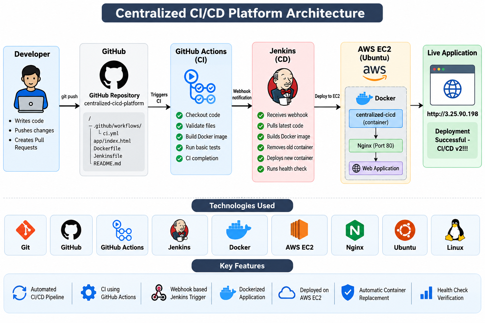
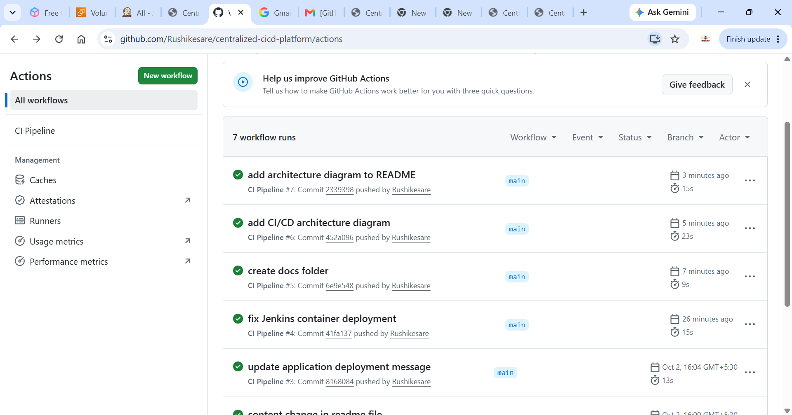
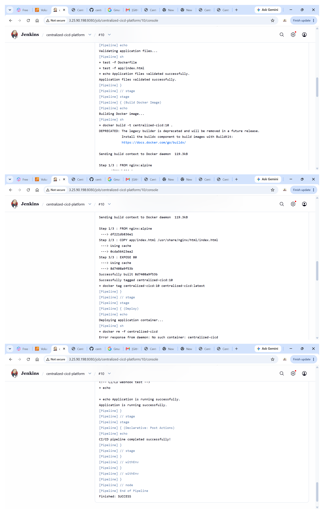

# Centralized CI/CD Platform

A centralized CI/CD platform that automates application validation, Docker image building, deployment, and health verification using GitHub Actions, Jenkins, Docker, and AWS EC2.

## Architecture



### GitHub Actions CI

The GitHub Actions workflow validates project files, validates HTML, and builds the Docker image on every push to the `main` branch.



## Continuous Deployment with Jenkins

Jenkins automates the deployment process after changes are pushed to GitHub.

### Jenkins CD Pipeline

The Jenkins pipeline performs the following steps:

1. Checks out the latest source code from GitHub
2. Validates application files
3. Builds the Docker image
4. Tags the Docker image
5. Removes the previous application container
6. Deploys the new Docker container on AWS EC2
7. Performs an application health check
8. Confirms successful deployment

### Jenkins Pipeline Execution

<p align="center">
  
</p>

The pipeline completed successfully with `Finished: SUCCESS`.

```text
Developer
    |
    | git push
    v
GitHub
    |
    +--------------------+
    |                    |
    v                    v
GitHub Actions        GitHub Webhook
    |                    |
    | CI                 v
    |                 Jenkins
    |                    |
    |                    v
    |                 Docker
    |                    |
    |                    v
    |                 AWS EC2
    |                    |
    |                    v
    |               Health Check
    |
    v
Docker Image Build
